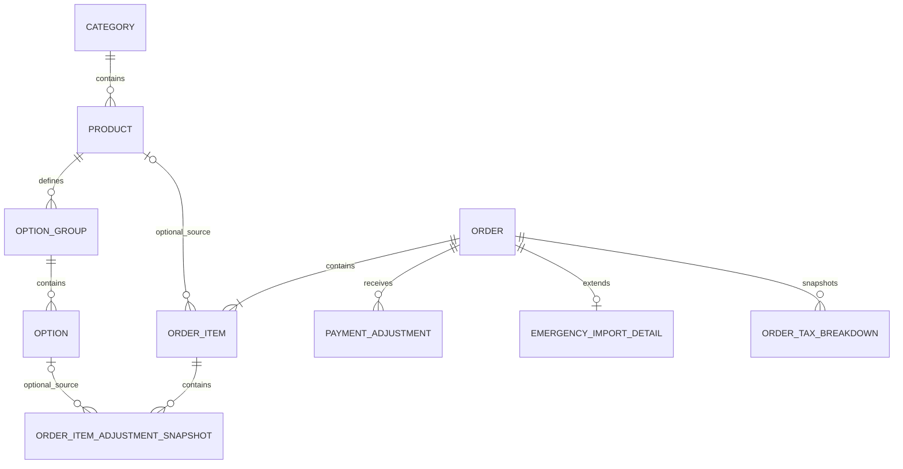

# Data model

**Status:** Draft — Phase 3 working design  
**Last updated:** 2026-08-27  
**Product:** Sushi81 POS  
**Purpose:** Define the logical business-data model required to implement the approved Sushi81 POS lifecycle, catalogue, payment, historical-snapshot and emergency-import behavior before physical storage details are frozen.

## 1. Scope

This document defines the **logical data model** for Sushi81 POS.

It covers:

- catalogue entities and technical identity;
- order identity and current lifecycle state;
- order-line historical snapshots;
- structured product-option snapshots;
- current cash/card payment totals and internally dated payment adjustments;
- future-order / due-today / overdue derivation;
- Hiboutik emergency-import data boundaries;
- business configuration needed by approved pricing rules;
- data needed for annual archive eligibility and historical reprinting;
- relationships that must remain stable even when current catalogue data is edited or deleted.

It deliberately does **not** yet choose:

- the physical database engine or exact SQLite/SQL column types;
- integer-cents versus another physical monetary encoding;
- file locations, live/archive database filenames or OneDrive synchronization behavior;
- backup/restore mechanics;
- final order-ID display format;
- final export-tracking schema;
- final printing layout;
- parser-specific Hiboutik email fields beyond the approved business data that must be retained.

Those decisions belong primarily to `architecture.md`, `storage-strategy.md`, `export.md`, `paste-order-import.md`, `printing.md` and `sync-and-backup.md`.

## 2. Authoritative baseline

This model must preserve the approved Phase 1/Phase 2 semantics already frozen in:

- `current-system.md`;
- `product-requirements.md`;
- `order-lifecycle.md`;
- `business-rules.md`;
- `catalogue-management.md`.

The most important consequences for the data model are:

1. current catalogue records and historical order data are independent after order confirmation;
2. product codes are editable and reusable, therefore they are not technical primary keys;
3. all non-cancelled orders may be modified in place using the same business order ID;
4. v1 retains only the latest saved business version of an order and does not require order revision history;
5. order status and payment information are separate concerns;
6. the operator works with current cumulative CB and Espèce amounts, while the application internally retains dated amount changes so cross-day received-payment summaries remain correct;
7. the authoritative order total may be manually changed and may temporarily differ from line arithmetic;
8. future, due-today and overdue are derived operational views rather than separate destructive order states;
9. Hiboutik emergency-import orders are operational copies and must remain excluded from ordinary POS-originated turnover, received-payment, Hiboutik-card-entry and export totals;
10. catalogue Excel import uses opaque internal identifiers for safe updates, but those identifiers must remain transparent/non-editable in normal operator workflows;
11. no customer/CRM subsystem is required in v1;
12. successful catalogue import does not require a permanent operator-facing import-history table;
13. while a manual order-total override is authoritative, the complete final TTC amount uses a single 10% VAT bucket rather than the normal mixed product/option VAT breakdown.

## 3. Design principles

### 3.1 Logical IDs are not business labels

Current catalogue entities use stable opaque internal identifiers such as `product_id`, `option_group_id` and `option_id`.

These identifiers:

- are generated and managed by the application;
- are not the operator-facing product code;
- do not carry business meaning;
- are not normally editable by the operator;
- may appear in protected/hidden Excel technical columns only when required for safe update matching.

The exact physical identifier type is deferred to the storage/architecture decision.

### 3.2 Historical orders are snapshots, not catalogue views

Once an order is confirmed, later catalogue edits, deactivation, deletion, code reuse, option changes or price changes must not alter that order.

Therefore an order line stores the sale-time business values needed for historical viewing, reporting and reprinting. A historical order must never require a successful join to the current `Product` table in order to know what was sold.

Optional technical links back to current catalogue entities may be retained for diagnostics/convenience, but historical correctness must not depend on them.

### 3.3 Current state is stored once; reporting views are derived

The model stores the durable facts needed to derive:

- Open / Closed / Cancelled;
- payment composition;
- unpaid / partial / fully reconciled state;
- future order;
- due-today advance order;
- overdue unsettled;
- daily received-payment totals;
- real-time operational turnover;
- Hiboutik emergency discrepancies.

These should not be duplicated as multiple independently editable status fields when they can be derived safely from authoritative data.

### 3.4 Business money is decimal money

All business amounts obey the approved €0.01 precision and round-half-up rules.

The physical representation is not frozen here, but implementation must not use binary floating-point semantics for persisted business money.

### 3.5 No unnecessary audit subsystems

The model must preserve the history that the approved workflow actually needs, but v1 must not introduce speculative history features.

In particular:

- no operator-visible order revision-history table is required;
- no permanent catalogue-import history/report table is required;
- no CRM/customer master table is required;
- no separate payment-method category is required because composition is derived from CB/Espèce amounts.

## 4. Logical entity overview

The core logical entities are:

- `Category`
- `Product`
- `OptionGroup`
- `Option`
- `Order`
- `OrderItem`
- `OrderItemAdjustmentSnapshot`
- `PaymentAdjustment`
- `EmergencyImportDetail`
- `BusinessSettings`
- `OrderTaxBreakdown`

A future export specification may add export-batch/export-state entities without changing the core order model.

The two `optional_source` relationships above are deliberately non-authoritative. Historical order rows remain valid even if the current catalogue source record is later edited or deleted.

## 5. Catalogue model

### 5.1 `Category`

Logical fields:

| Field | Required | Meaning |
|---|---:|---|
| `category_id` | yes | Opaque technical identity |
| `name` | yes | Current editable category name |
| `created_at` | yes | Technical creation timestamp |
| `updated_at` | yes | Technical last-update timestamp |

Every current product references one category.

Historical orders do not depend on the current category name because the sale-time category name is copied into the order-line snapshot.

The exact duplicate-name policy and any category display-order field are not frozen here because Phase 2 intentionally deferred category ordering/shortcut behavior to later UI design.

### 5.2 `Product`

Logical fields:

| Field | Required | Meaning |
|---|---:|---|
| `product_id` | yes | Opaque internal product identity |
| `code` | yes | Editable operator-facing current product code |
| `name` | yes | Current product name |
| `category_id` | yes | Current category relationship |
| `price_ttc` | yes | Current TTC base selling price |
| `vat_rate` | yes | Current product VAT rate/category |
| `is_active` | yes | Whether product appears in normal order selection |
| `discount_eligible` | yes | Eligibility for normal Retrait discount |
| `options_enabled` | yes | Whether structured options are enabled for this product |
| `created_at` | yes | Technical creation timestamp |
| `updated_at` | yes | Technical last-update timestamp |

Constraints required by approved behavior:

- `code` is unique among **current** products;
- `code` is editable;
- deleting a current product releases its code for reuse;
- historical use of a code does not reserve it;
- product deletion must never cascade into historical order data.

### 5.3 `OptionGroup`

Logical fields:

| Field | Required | Meaning |
|---|---:|---|
| `option_group_id` | yes | Opaque internal identity |
| `product_id` | yes | Parent current product |
| `name` | yes | Operator-facing group/prompt label |
| `selection_mode` | yes | `SINGLE` or `MULTI` |
| `is_required` | yes | Required/optional semantic |
| `min_selections` | conditional | Multi-select minimum |
| `max_selections` | conditional | Multi-select maximum |
| `display_order` | yes | Persisted product-specific group order |
| `created_at` | yes | Technical creation timestamp |
| `updated_at` | yes | Technical last-update timestamp |

Approved validation is represented logically as follows:

- required single-select => exactly one selection;
- optional single-select => zero or one;
- required multi-select => minimum at least one;
- optional multi-select may have minimum zero;
- multi-select minimum may not exceed maximum.

Phase 2 approved independent activation for individual options and product-level option enable/disable. It did not explicitly require a separate active/inactive flag for option groups, so this draft does not invent one.

### 5.4 `Option`

Logical fields:

| Field | Required | Meaning |
|---|---:|---|
| `option_id` | yes | Opaque internal identity |
| `option_group_id` | yes | Parent option group |
| `name` | yes | Choice label |
| `price_adjustment_ttc` | yes | Preset positive, negative or zero adjustment |
| `is_active` | yes | Offered for new orders when active |
| `display_order` | yes | Persisted order inside the group |
| `created_at` | yes | Technical creation timestamp |
| `updated_at` | yes | Technical last-update timestamp |

The VAT rule for the option adjustment is not an operator-editable catalogue field:

- positive adjustment => 5.5% VAT;
- negative adjustment => inherit the associated product VAT;
- zero adjustment => no monetary tax effect.

The order snapshot stores the actual sale-time VAT treatment so historical reprinting never depends on a later rule/catalogue change.

## 6. Order model

### 6.1 `Order`

`Order` is the durable current/latest business representation of one POS order or one Hiboutik emergency-import copy.

Logical fields:

| Field | Required | Meaning |
|---|---:|---|
| `order_id` | yes | Stable unique business order identity allocated at confirmation |
| `source_type` | yes | `POS` or `HIBOUTIK_EMERGENCY` |
| `status` | yes | `OPEN`, `CLOSED` or `CANCELLED` |
| `created_at` | yes | Original durable order creation timestamp |
| `updated_at` | yes | Latest saved modification timestamp |
| `closed_at` | no | Timestamp of current/latest successful close |
| `cancelled_at` | no | Cancellation timestamp when cancelled |
| `fulfilment_mode` | yes | `RETRAIT` or `LIVRAISON` |
| `planned_fulfilment_date` | yes | Business date to which operational turnover/reminders are attributed |
| `planned_fulfilment_time` | no | Structured pickup/delivery time when known |
| `advance_order_marker` | yes | Technical/business marker used to preserve advance-order reminder semantics |
| `telephone` | no | Order-level telephone text; no Customer entity required |
| `delivery_address` | no | Latest saved delivery address; may be empty even for initial Livraison confirmation |
| `comment` | no | Flexible operational free text |
| `total_ttc` | yes | Single authoritative current order total |
| `manual_total_override_active` | yes | Whether `total_ttc` currently comes from an operator manual override rather than the latest normal price calculation |
| `pickup_discount_applied` | yes | Whether the normal Retrait discount is currently applied |
| `pickup_discount_rate_snapshot` | no | Applied rate snapshot when the discount is active |
| `delivery_fee_ttc_snapshot` | yes | Current applied order-level delivery fee, normally €0 in v1 |

`manual_total_override_active` is required because the final numeric total alone cannot tell the application which VAT rule is authoritative. Its lifecycle is simple:

- normal system price calculation writes `total_ttc` and sets the marker to `false`;
- direct operator editing of `total_ttc` sets the marker to `true`;
- any later price-affecting change triggers normal recalculation and resets it to `false`;
- another direct manual edit sets it to `true` again.

### 6.2 Order identity

`order_id` is created only when the order is first confirmed.

Ordinary modification:

- edits the same `Order` record;
- retains the same `order_id`;
- replaces the latest business values;
- does not create a revision-history chain.

Creating a **new order from existing customer information** creates a new `Order` with a new `order_id`; it is not a child revision of the source order.

The exact visible order-ID format is intentionally deferred. The model only requires uniqueness, stability and allocation at confirmation.

### 6.3 Status timestamps

`closed_at` supports the approved settlement-year/archive rule without creating an order-history subsystem.

Recommended lifecycle semantics:

- when an order is successfully closed, set `status = CLOSED` and `closed_at` to the effective close timestamp;
- if a later edit makes CB + Espèce differ from `total_ttc`, the order becomes `OPEN` again and `closed_at` is cleared;
- when it is closed again, `closed_at` receives the new close timestamp;
- cancellation sets `status = CANCELLED` and `cancelled_at`.

Only the latest current business state is retained, consistent with the Phase 2 decision not to retain business revision history.

### 6.4 `advance_order_marker`

The approved UI distinguishes ordinary same-day orders from advance orders that later become due today.

A pure comparison of the **current** planned date with `created_at` is insufficient in every edit scenario because the planned date itself may later change.

This draft therefore preserves a minimal marker indicating that the order has participated in the advance-order workflow. It is not a separate lifecycle status; future/due-today behavior remains derived from the current planned date plus this marker.

Exact set/reset semantics should be confirmed during Phase 3 review, but the model should preserve enough information that editing a future date does not destroy the ability to identify an advance order when it becomes due today.

## 7. Historical order-line snapshots

### 7.1 `OrderItem`

Each confirmed order contains one or more `OrderItem` rows.

Logical fields:

| Field | Required | Meaning |
|---|---:|---|
| `order_item_id` | yes | Stable line identity inside persisted order |
| `order_id` | yes | Parent order |
| `line_position` | yes | Saved display/print order |
| `source_product_id` | no | Optional non-authoritative link to current catalogue product |
| `product_code_snapshot` | yes | Sale-time product code |
| `product_name_snapshot` | yes | Sale-time product name |
| `category_name_snapshot` | yes | Sale-time category name |
| `base_unit_price_ttc_snapshot` | yes | Sale-time catalogue base TTC price |
| `product_vat_rate_snapshot` | yes | Sale-time product VAT |
| `discount_eligible_snapshot` | yes | Sale-time discount eligibility |
| `quantity` | yes | Ordered quantity |
| `base_line_total_ttc_snapshot` | yes | Sale-time base price × quantity result under approved rounding |
| `calculated_line_total_ttc_snapshot` | yes | System-calculated line result including saved adjustments/discount logic before any unallocated order-level manual total override |

Important semantics:

- the snapshot is refreshed when the operator intentionally modifies and saves the order;
- it is not refreshed merely because the current catalogue changes;
- deleting the source product must not delete or invalidate the order item;
- historical reporting/reprinting uses snapshot values.

`calculated_line_total_ttc_snapshot` intentionally preserves the system-calculated commercial line result even when `Order.total_ttc` is later manually overridden. The approved lifecycle allows the authoritative order total to differ from item arithmetic.

### 7.2 `OrderItemAdjustmentSnapshot`

Selected predefined options and operator-entered custom option adjustments are stored as sale-time snapshots attached to the relevant order line.

Logical fields:

| Field | Required | Meaning |
|---|---:|---|
| `order_item_adjustment_id` | yes | Snapshot row identity |
| `order_item_id` | yes | Parent order line |
| `display_order` | yes | Saved display/print order |
| `kind` | yes | `PREDEFINED_OPTION` or `CUSTOM_ADJUSTMENT` |
| `source_option_id` | no | Optional non-authoritative catalogue link |
| `option_group_name_snapshot` | no | Group label when applicable |
| `label_snapshot` | yes | Selected option/custom adjustment label |
| `adjustment_ttc_snapshot` | yes | Positive, negative or zero amount |
| `vat_rate_snapshot` | conditional | Sale-time VAT treatment for monetary adjustments |

This unified snapshot entity supports:

- zero-price descriptive choices;
- positive preset surcharges;
- negative preset adjustments;
- custom positive/negative adjustments with required labels;
- multiple selections within one group;
- historical preservation after current options are renamed, deactivated or removed.

The historical row does not depend on the current `Option` record remaining present.

## 8. Discount and pricing snapshots

The current business configuration may change after an order is created. Historical orders therefore must retain the pricing facts actually used at the time of their latest saved business state.

At minimum:

- `Order.pickup_discount_applied` records whether the normal discount is active;
- `Order.pickup_discount_rate_snapshot` records the actual rate used;
- `Order.delivery_fee_ttc_snapshot` records the fee actually applied;
- `Order.manual_total_override_active` records whether the current authoritative total is a manual override and therefore whether the single 10% VAT override rule applies;
- `OrderItem.discount_eligible_snapshot` records sale-time eligibility;
- option adjustment amount/VAT snapshots preserve their sale-time result;
- system-calculated line results are persisted as snapshots rather than depending on current catalogue values.

The current configured Retrait minimum and Livraison minimum are **validation parameters**, not historical financial values that must be copied to each order.

A later price-affecting order change recalculates the relevant pricing snapshots under the then-current approved business settings, replaces the prior latest saved values and resets `manual_total_override_active = false`, consistent with the approved same-order modification model.

## 9. Payment model

### 9.1 No separate payment-method field

V1 does not store an independently selected `CB`, `Espèce` or `Mixte` order-level method.

The current composition is derived from cumulative amounts:

- CB = 0 and Espèce = 0 => not recorded/unpaid;
- CB > 0 and Espèce = 0 => card-only;
- CB = 0 and Espèce > 0 => cash-only;
- CB > 0 and Espèce > 0 => mixed.

The close rule remains:

`current CB + current Espèce = Order.total_ttc`

### 9.2 `PaymentAdjustment`

The application internally persists signed dated changes rather than only overwriting one total amount.

Logical fields:

| Field | Required | Meaning |
|---|---:|---|
| `payment_adjustment_id` | yes | Technical event identity |
| `order_id` | yes | Parent order |
| `bucket` | yes | `CB` or `ESPECE` |
| `delta_amount` | yes | Signed change to cumulative amount |
| `effective_at` | yes | Business date/time to which this received/corrected amount is attributed |
| `recorded_at` | yes | Timestamp at which the application recorded the change |

Current cumulative values are derived as:

- current CB = sum of CB deltas for the order;
- current Espèce = sum of Espèce deltas for the order.

Example:

- day 1 target CB changes from €0 to €20 => `+20` CB adjustment on day 1;
- day 2 target CB changes from €20 to €50 => `+30` CB adjustment on day 2;
- later correction from €50 to €45 => `-5` CB adjustment at the correction's effective date/time.

This directly implements the approved Phase 2 requirement that daily received-payment summaries count only the amount newly attributed to each date rather than recounting the full cumulative payment.

The UI does not need to expose this event ledger. It continues to show/edit current cumulative CB and Espèce amounts.

### 9.3 Why both `effective_at` and `recorded_at` exist

The business summary is based on when money is actually received/effectively attributed, while technical persistence may happen later during correction/reconciliation.

Keeping both timestamps avoids forcing the physical model to lose that distinction. The later UI/workflow design may decide whether operators can back-date a correction or whether `effective_at` normally equals `recorded_at`.

### 9.4 Cancellation does not destroy payment facts

Cancelling an order does not delete its `PaymentAdjustment` rows.

Its current CB/Espèce values therefore remain available for reference as required by the lifecycle specification.

Ordinary received-payment and turnover queries exclude Cancelled orders according to the approved reporting rules rather than erasing the underlying retained amounts.

## 10. Derived lifecycle/reporting views

The following are logical queries/views, not separately editable business fields.

### 10.1 Current payment state

Derived from current CB + current Espèce relative to `Order.total_ttc`:

- zero recorded => unpaid/payment not recorded;
- recorded total below order total => partial/unsettled;
- recorded total equals order total => arithmetically reconciled/eligible to close;
- overpayment => close validation error until corrected.

`Order.status = CLOSED` still requires the explicit close action; equality alone does not silently replace the saved lifecycle status.

### 10.2 Future order

Derived primarily from:

`planned_fulfilment_date > current_business_date`

### 10.3 Due-today advance order

Derived from:

- `planned_fulfilment_date = current_business_date`;
- `advance_order_marker = true`;
- order not Cancelled.

Payment/Closed state does not remove the operational reminder.

### 10.4 Overdue unsettled

Derived from:

- `planned_fulfilment_date < current_business_date`;
- order not Cancelled;
- order not fully closed/reconciled under the approved lifecycle.

### 10.5 Real-time operational turnover

For a date D:

- include ordinary `source_type = POS` orders;
- exclude Cancelled orders;
- sum current authoritative `total_ttc` where `planned_fulfilment_date = D`;
- ignore payment state/closure for turnover attribution.

Hiboutik emergency copies are excluded to prevent double counting.

### 10.6 Daily received-payment totals

For date D:

- use `PaymentAdjustment.effective_at` on date D;
- group by CB/Espèce bucket;
- include ordinary POS-originated orders under approved status/source filters;
- count deltas rather than whole cumulative order payment;
- exclude Hiboutik emergency copies from ordinary POS received-payment totals;
- exclude Cancelled orders from ordinary summaries according to Phase 2 rules.

## 11. Hiboutik emergency-import extension

### 11.1 Shared `Order` model

A Hiboutik emergency-import copy uses the normal `Order`/`OrderItem` structures so that it can:

- be viewed;
- be printed/reprinted;
- participate in future/due-today reminders;
- store the POS operational/actual total;
- store payment outcome for discrepancy review.

It is distinguished by:

`Order.source_type = HIBOUTIK_EMERGENCY`

This source discriminator is mandatory because emergency copies must be systematically excluded from ordinary POS-originated financial/statistical/export calculations.

### 11.2 `EmergencyImportDetail`

Source-specific approved fields belong in a one-to-one extension rather than cluttering every normal POS order with Hiboutik-only columns.

Logical fields:

| Field | Required | Meaning |
|---|---:|---|
| `order_id` | yes | One-to-one link to emergency `Order` |
| `hiboutik_original_total_ttc` | yes | Original total preserved from Hiboutik email |

Additional parser/source metadata such as an external Hiboutik reference or sanitized source text may be added later by `paste-order-import.md` if a concrete requirement is approved.

The emergency discrepancy can be derived from:

- `hiboutik_original_total_ttc`;
- `Order.total_ttc` as POS operational/actual amount;
- current derived CB/Espèce payment amounts.

No duplicated Hiboutik-specific amount is required for ordinary `source_type = POS` orders.

## 12. Business configuration

### 12.1 `BusinessSettings`

The approved commercial settings belong in durable application business data rather than source-code constants.

A logical singleton/current-settings entity contains at least:

| Field | Required | Default |
|---|---:|---:|
| `pickup_discount_rate` | yes | 10% |
| `pickup_discount_min_total_ttc` | yes | €15.00 |
| `delivery_min_merchandise_total_ttc` | yes | €30.00 |
| `delivery_fee_enabled` | yes | false |
| `delivery_fee_amount_ttc` | yes | €0.00 |
| `updated_at` | yes | — |

V1 does not require a history table for settings changes.

Historical reproducibility is achieved by storing the relevant **applied pricing snapshots** on the order/order lines rather than by reconstructing old orders from the current settings row.

## 13. VAT/tax breakdown snapshot

Customer receipts must preserve VAT information and archived orders must remain reprintable.

For that reason the logical model provides a durable order-level tax breakdown rather than relying on current catalogue/settings at reprint time.

### 13.1 `OrderTaxBreakdown`

Logical fields:

| Field | Required | Meaning |
|---|---:|---|
| `order_tax_breakdown_id` | yes | Technical identity |
| `order_id` | yes | Parent order |
| `vat_rate` | yes | VAT rate represented by this row |
| `taxable_ttc_amount` | yes | TTC amount allocated to this VAT rate |
| `vat_amount` | yes | VAT amount under approved round-half-up rules |

The rows are replaced whenever a price-affecting modification causes the order to be recalculated and saved, and they are also replaced when the operator manually changes the authoritative total.

### 13.2 Normal calculated total

When `Order.manual_total_override_active = false`, the tax breakdown is generated from the actual sale-time product/option/fee VAT rules and may therefore contain multiple VAT buckets.

The persisted `OrderTaxBreakdown` rows are authoritative for historical receipt reprinting; later catalogue changes do not alter them.

### 13.3 Manual total override — approved rule

When `Order.manual_total_override_active = true`:

- discard the normal mixed VAT allocation for the current final tax snapshot;
- create exactly one `OrderTaxBreakdown` row;
- set `vat_rate = 10%`;
- set `taxable_ttc_amount = Order.total_ttc`;
- calculate the VAT included in that TTC amount at 10% and round the final VAT amount using the approved round-half-up cent rule.

For a TTC amount `T`, the VAT included at 10% is conceptually:

`VAT = T - (T / 1.10)`

with the final stored/displayed VAT rounded consistently to €0.01 under the approved rounding rule.

This applies to the **entire final manual amount**, regardless of the original products' VAT rates and regardless of whether the override increases or decreases the system-calculated total.

A later price-affecting change resets `manual_total_override_active = false`, recalculates `total_ttc` and regenerates the normal product/option VAT breakdown. A later manual edit sets the marker to `true` again and regenerates the single 10% bucket.

## 14. Telephone-history assistance without CRM

V1 should not introduce a Customer table merely to support telephone-history lookup.

Historical assistance can query existing orders using the optional order-level telephone value and display reusable information such as prior delivery addresses/comments.

Implementation may maintain a normalized/searchable representation or index of the telephone value for efficient matching, but that is a technical optimization rather than a separate customer business entity.

Creating a new order from an existing order copies reusable text values only; it does not establish a durable customer master relationship.

## 15. Archive-related data requirements

The physical archive strategy belongs to `storage-strategy.md`, but the data model must preserve fields needed to decide archive eligibility and retain historical behavior.

At minimum:

- original `created_at` remains unchanged;
- original/current planned fulfilment date remains explicit;
- `status` remains explicit;
- `closed_at` identifies the current/latest settlement/close year for ordinary reconciled orders;
- unresolved Open orders can remain in the live database across a natural-year boundary;
- order-line/product/option/tax snapshots make archived orders independent of future catalogue changes.

The archive rule for ordinary Closed orders can therefore use the natural year of `closed_at`, consistent with the approved settlement-year principle.

The precise archive-year treatment of Cancelled orders and Hiboutik emergency copies should be frozen in `storage-strategy.md` because Phase 2 does not explicitly assign those records a settlement year.

Live and archive databases should use the same logical order schema so archived orders remain queryable/reprintable without lossy transformation.

## 16. Data explicitly not modeled in v1 core

Unless a later approved document adds a concrete requirement, the core data model does not include:

- employee/user accounts;
- permissions/roles;
- customer master/CRM profiles;
- inventory/stock entities;
- supplier/purchasing entities;
- accounting journal entities;
- card-terminal transaction IDs or refund execution;
- telephone-versus-walk-in order-source classification;
- ordinary order revision history;
- permanent catalogue-import report/history;
- automatic Hiboutik submission records;
- full Hiboutik web-order synchronization;
- current-catalogue dependency for historical order interpretation.

## 17. Phase 3 decisions still required before approval

The logical structure above can already support the approved lifecycle, catalogue, payment and manual-total VAT behavior. The following points remain unresolved and should be decided before this document becomes an approved Phase 3 baseline.

### 17.1 Delivery-fee VAT treatment — blocking if the setting can be enabled in v1

Phase 2 approved a configurable fixed delivery-fee entry point but did not freeze the VAT rate/treatment of that fee.

Because a non-zero enabled fee becomes part of the order total, receipt, turnover and export, its VAT treatment must be defined before production use of the feature.

### 17.2 Advance-order marker semantics — confirm

This draft recommends one minimal persisted marker so the application can distinguish an advance order that has become due today from an ordinary same-day order even after planned-date edits.

The project should confirm when that marker becomes true and whether it is ever reset.

Recommended rule: once a non-cancelled order has been saved with a planned fulfilment date later than the then-current business date, `advance_order_marker` becomes true and remains true for that order.

### 17.3 Category duplicate-name policy — confirm or defer

The model gives categories their own internal IDs, but Phase 2 did not explicitly state whether two current categories may share the same visible name.

For practical UI/import behavior, unique current category names are recommended, but this should be confirmed rather than silently introduced as a business constraint.

## 18. Approval rule

This file remains **Draft — Phase 3 working design** until the open decisions in section 17 are reviewed and the logical entity structure is explicitly approved.

Implementation must not turn the draft into a physical schema before the remaining delivery-fee/advance-order/category questions are resolved and the related architecture/storage documents are aligned.
