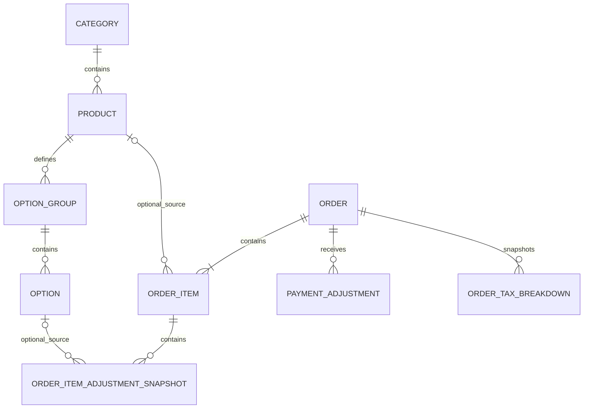

# Data model

**Status:** Approved — Phase 3 baseline  
**Last updated:** 2026-08-27  
**Product:** Sushi81 POS  
**Purpose:** Define the logical business-data model required to implement the approved Sushi81 POS lifecycle, catalogue, payment, historical-snapshot and source-boundary behavior.

## 1. Scope

This document defines the **logical V1 data model** for Sushi81 POS.

It covers:

- catalogue entities and opaque technical identity;
- order identity and current lifecycle state;
- historical order-line and option snapshots;
- current CB/Espèce totals derived from internally dated payment adjustments;
- future / due-today / overdue derivation;
- the minimal hidden source discriminator required for Hiboutik paste-created orders;
- business configuration required by approved pricing rules;
- tax snapshots;
- annual archive eligibility facts;
- relationships that must remain stable when current catalogue data changes or is deleted.

Physical storage choices are frozen primarily in `architecture.md` and `storage-strategy.md`. Export-specific technical history belongs to `export.md`; parser behavior belongs to `paste-order-import.md`; print behavior belongs to `printing.md`.

V1 does not require a separate `sync-and-backup.md`: live storage, recovery, OneDrive handoff, disaster recovery and annual archives are already authoritative in `storage-strategy.md`.

## 2. Authoritative consequences

The logical model must preserve these approved semantics:

1. current catalogue records and historical order data are independent after order confirmation;
2. product codes are editable/reusable and therefore are not technical primary keys;
3. all non-cancelled orders may be modified in place using the same stable order ID;
4. V1 retains only the latest saved business version of an order and does not require operator-visible revision history;
5. order status and payment information are separate;
6. the operator works with cumulative CB/Espèce amounts while the application internally retains dated signed amount changes;
7. the authoritative order total may be manually changed and may temporarily differ from product-line arithmetic;
8. future, due-today and overdue are derived views rather than separate destructive order statuses;
9. a Hiboutik paste-created order uses the ordinary order model and is distinguished only by a hidden source discriminator required to prevent double counting/export;
10. catalogue `.xlsx` update import uses opaque internal identifiers while keeping them transparent/non-editable to the normal operator;
11. no Customer/CRM master entity is required in V1;
12. successful catalogue import does not require a permanent operator-facing import-history entity;
13. while a manual total override is active, the complete authoritative TTC amount uses one 10% VAT bucket;
14. a non-zero enabled delivery fee uses fixed 10% VAT under normal calculated pricing;
15. once an order has been saved as a future order, `advance_order_marker` remains true permanently for that order;
16. every current category has a unique operator-facing name independently of its opaque internal identity.

## 3. Design principles

### 3.1 Opaque IDs are not business labels

Current catalogue entities use stable opaque identifiers such as:

- `category_id`;
- `product_id`;
- `option_group_id`;
- `option_id`.

These IDs:

- are generated/managed by the application;
- do not carry operator-facing business meaning;
- are not normally editable by the operator;
- may appear only in protected/hidden technical workbook columns when required for safe update matching.

Business-visible uniqueness rules exist in addition to technical IDs. Current product codes and current category names are unique business-facing values but are not technical primary keys.

### 3.2 Historical orders are snapshots

A confirmed order must remain interpretable after current catalogue data is renamed, repriced, deactivated, deleted or reused.

Historical correctness therefore depends on persisted order snapshots, not successful joins back to the current catalogue.

Optional source links may remain for diagnostics/convenience but are non-authoritative.

### 3.3 Store durable facts once; derive views

The model stores authoritative facts and derives:

- Open / Closed / Cancelled;
- payment composition/state;
- future order;
- due-today advance order;
- overdue unsettled;
- daily received-payment totals;
- operational turnover;
- source-based financial/export inclusion.

Derived conditions are not independently editable duplicate states.

### 3.4 Business money

Persisted euro money uses the physical integer-cent representation frozen in `architecture.md`. Business calculations use decimal arithmetic and approved round-half-up behavior.

Binary floating-point semantics must not determine persisted business-money results.

### 3.5 No speculative audit/business subsystems

V1 does not introduce:

- operator-visible order revision history;
- permanent catalogue-import history;
- Customer/CRM master solely for order reuse;
- a separate payment-method category;
- a dedicated Hiboutik emergency-order entity/reconciliation model.

Technical logs, migration metadata and export-ledger metadata may exist where required for reliability but do not create new user-facing business workflows.

## 4. Logical entity overview

Core V1 logical business entities are:

- `Category`
- `Product`
- `OptionGroup`
- `Option`
- `Order`
- `OrderItem`
- `OrderItemAdjustmentSnapshot`
- `PaymentAdjustment`
- `BusinessSettings`
- `OrderTaxBreakdown`

Export uses separate technical integration metadata as specified by `export.md`; no export entity changes the core order lifecycle.

The `optional_source` relationships are non-authoritative. Historical rows remain valid even when their former current catalogue source is later changed or deleted.

## 5. Catalogue model

### 5.1 `Category`

Logical fields:

| Field | Required | Meaning |
|---|---:|---|
| `category_id` | yes | Opaque technical identity |
| `name` | yes | Current editable business-unique category name |
| `created_at` | yes | Technical creation timestamp |
| `updated_at` | yes | Technical last-update timestamp |

Constraints:

- each current product references one category;
- current category names are business-visible unique;
- edits/imports creating visually equivalent duplicates are rejected, including surrounding-whitespace/case-only differences;
- historical order lines store their own category-name snapshot.

Category display-order/shortcut mechanics remain a UI implementation choice and do not require a new V1 business entity.

### 5.2 `Product`

Logical fields:

| Field | Required | Meaning |
|---|---:|---|
| `product_id` | yes | Opaque current product identity |
| `code` | yes | Editable operator-facing product code |
| `name` | yes | Current product name |
| `category_id` | yes | Current category relationship |
| `price_ttc` | yes | Current TTC base selling price |
| `vat_rate` | yes | Current product VAT rate/category |
| `is_active` | yes | Offered in normal new-order selection when true |
| `discount_eligible` | yes | Eligibility for normal Retrait discount |
| `options_enabled` | yes | Whether structured option prompting is enabled |
| `created_at` | yes | Technical creation timestamp |
| `updated_at` | yes | Technical last-update timestamp |

Constraints:

- current `code` is unique;
- code is editable;
- permanent deletion releases the code for reuse;
- historical code use does not reserve it;
- deletion does not cascade to historical order data.

### 5.3 `OptionGroup`

Logical fields:

| Field | Required | Meaning |
|---|---:|---|
| `option_group_id` | yes | Opaque technical identity |
| `product_id` | yes | Parent current product |
| `name` | yes | Operator-facing group/prompt label |
| `selection_mode` | yes | `SINGLE` or `MULTI` |
| `is_required` | yes | Required/optional semantics |
| `min_selections` | conditional | Multi-select minimum |
| `max_selections` | conditional | Multi-select maximum |
| `display_order` | yes | Product-specific prompt order |
| `created_at` | yes | Technical creation timestamp |
| `updated_at` | yes | Technical last-update timestamp |

Validation:

- required single-select => exactly one;
- optional single-select => zero or one;
- required multi-select => minimum >= 1;
- optional multi-select may use minimum 0;
- multi-select minimum cannot exceed maximum.

A separate group active/inactive flag is not required because V1 already has product-level options enablement and individual option activation.

### 5.4 `Option`

Logical fields:

| Field | Required | Meaning |
|---|---:|---|
| `option_id` | yes | Opaque technical identity |
| `option_group_id` | yes | Parent option group |
| `name` | yes | Choice label |
| `price_adjustment_ttc` | yes | Preset positive/negative/zero adjustment |
| `is_active` | yes | Offered for new orders when true |
| `display_order` | yes | Persisted order inside group |
| `created_at` | yes | Technical creation timestamp |
| `updated_at` | yes | Technical last-update timestamp |

Option adjustment VAT is automatic:

- positive adjustment => 5.5%;
- negative adjustment => associated product VAT;
- zero => no monetary tax effect.

The actual sale-time amount/VAT is snapshotted on the order line.

## 6. Order model

### 6.1 `Order`

`Order` is the durable latest business representation of one Sushi81 POS order, regardless of whether the entry was manual or created through Hiboutik paste import.

Logical fields:

| Field | Required | Meaning |
|---|---:|---|
| `order_id` | yes | Stable unique business order identity allocated at confirmation |
| `source_type` | yes | Hidden discriminator: `POS` or `HIBOUTIK_PASTE` |
| `status` | yes | `OPEN`, `CLOSED` or `CANCELLED` |
| `created_at` | yes | Original durable creation timestamp |
| `updated_at` | yes | Latest saved modification timestamp |
| `closed_at` | no | Timestamp of current/latest successful close |
| `cancelled_at` | no | Cancellation timestamp |
| `fulfilment_mode` | yes | `RETRAIT` or `LIVRAISON` |
| `planned_fulfilment_date` | yes | Business date for reminders/turnover |
| `planned_fulfilment_time` | no | Structured planned time |
| `advance_order_marker` | yes | Sticky marker that order has ever been saved for a future date |
| `telephone` | no | Order telephone text |
| `delivery_address` | no | Latest saved delivery address |
| `comment` | no | Flexible operational text |
| `total_ttc` | yes | Current authoritative order total |
| `manual_total_override_active` | yes | Whether current total is a manual override |
| `pickup_discount_applied` | yes | Whether normal Retrait discount is active |
| `pickup_discount_rate_snapshot` | no | Applied rate when discount is active |
| `delivery_fee_ttc_snapshot` | yes | Current applied order-level delivery fee |

`source_type` is non-user-facing. `HIBOUTIK_PASTE` does not create a special order subtype or different UI; it exists only for automatic source inclusion/exclusion rules.

### 6.2 Manual-total marker

`manual_total_override_active` is required because the numeric total alone cannot identify which VAT rule is authoritative.

Semantics:

- normal pricing writes `total_ttc` and sets marker `false`;
- operator directly edits `total_ttc` -> marker `true`;
- later price-affecting change recalculates total -> marker `false`;
- another direct manual edit -> marker `true` again.

### 6.3 Order identity and modification

`order_id` is allocated only on first confirmation.

Ordinary modification:

- updates the same Order;
- retains the same ID;
- replaces latest saved business values;
- does not create a user-facing revision chain.

Creating a new order from previous reusable customer information creates a new Order/new ID and does not establish a master-customer relation.

The exact visible order-ID rendering is a technical/UI choice, but uniqueness and stability are mandatory.

### 6.4 Status timestamps

Approved semantics:

- successful Close => `status = CLOSED`, set `closed_at`;
- later saved edit causing CB + Espèce != total => `status = OPEN`, clear `closed_at`;
- later Close again => set a new current `closed_at`;
- cancellation => `status = CANCELLED`, set `cancelled_at`.

Only latest business state is required.

### 6.5 `advance_order_marker`

Semantics:

- starts `false`;
- if a non-cancelled order is saved while planned fulfilment date > current business date, set `true`;
- once `true`, never reset for that order;
- later date/time/product/payment/customer changes do not reset it;
- cancellation need not clear it because Cancelled state independently excludes active reminders.

The marker is not a status. It remembers participation in the advance-order workflow so a previously future order can be distinguished when it becomes due today.

## 7. Historical order-line snapshots

### 7.1 `OrderItem`

Logical fields:

| Field | Required | Meaning |
|---|---:|---|
| `order_item_id` | yes | Stable persisted line identity |
| `order_id` | yes | Parent order |
| `line_position` | yes | Saved display/print order |
| `source_product_id` | no | Optional non-authoritative current product link |
| `product_code_snapshot` | yes | Sale-time product code |
| `product_name_snapshot` | yes | Sale-time product name |
| `category_name_snapshot` | yes | Sale-time category name |
| `base_unit_price_ttc_snapshot` | yes | Sale-time catalogue base TTC price |
| `product_vat_rate_snapshot` | yes | Sale-time product VAT |
| `discount_eligible_snapshot` | yes | Sale-time discount eligibility |
| `quantity` | yes | Ordered quantity |
| `base_line_total_ttc_snapshot` | yes | Base price × quantity result under approved rounding |
| `calculated_line_total_ttc_snapshot` | yes | System-calculated line result before any order-level manual total override |

The snapshot is refreshed only when the operator intentionally modifies/saves that order, not merely because the live catalogue changes.

Historical viewing/reporting/printing/export use these snapshots.

### 7.2 `OrderItemAdjustmentSnapshot`

Selected predefined options and custom line adjustments are stored as sale-time snapshots.

Logical fields:

| Field | Required | Meaning |
|---|---:|---|
| `order_item_adjustment_id` | yes | Snapshot row identity |
| `order_item_id` | yes | Parent line |
| `display_order` | yes | Saved display/print order |
| `kind` | yes | `PREDEFINED_OPTION` or `CUSTOM_ADJUSTMENT` |
| `source_option_id` | no | Optional non-authoritative current option link |
| `option_group_name_snapshot` | no | Group label where applicable |
| `label_snapshot` | yes | Choice/custom adjustment label |
| `adjustment_ttc_snapshot` | yes | Positive/negative/zero amount |
| `vat_rate_snapshot` | conditional | Sale-time VAT for monetary adjustment |

This supports historical preservation after option rename/deactivation/deletion.

## 8. Pricing snapshots

Historical orders retain the current saved business result independently of later settings changes.

At minimum:

- `pickup_discount_applied` records current normal-discount application;
- `pickup_discount_rate_snapshot` records actual applied rate;
- `delivery_fee_ttc_snapshot` records actual applied fee;
- enabled non-zero normal delivery fee uses fixed 10% VAT;
- `manual_total_override_active` records whether the single-10%-bucket rule is authoritative;
- `discount_eligible_snapshot` records line sale-time eligibility;
- option adjustments retain sale-time amount/VAT snapshots;
- calculated line totals remain persisted even when the final Order total is manually overridden.

Current configured minimum thresholds are validation parameters and do not need to be copied to every order.

A later price-affecting saved change recalculates relevant snapshots under then-current approved settings and resets manual override state.

## 9. Payment model

### 9.1 No separate order-level payment-method field

Current composition is derived from cumulative amounts:

- CB = 0, Espèce = 0 -> unpaid/not recorded;
- CB > 0, Espèce = 0 -> card only;
- CB = 0, Espèce > 0 -> cash only;
- both > 0 -> mixed.

The Close rule remains:

`current CB + current Espèce = Order.total_ttc`

### 9.2 `PaymentAdjustment`

The application persists signed dated changes.

Logical fields:

| Field | Required | Meaning |
|---|---:|---|
| `payment_adjustment_id` | yes | Technical event identity |
| `order_id` | yes | Parent order |
| `bucket` | yes | `CB` or `ESPECE` |
| `delta_amount` | yes | Signed cumulative-value change |
| `effective_at` | yes | Business date/time to which change is attributed |
| `recorded_at` | yes | Technical persistence timestamp |

Current cumulative values are sums of deltas by bucket.

The normal UI edits cumulative values; it does not need to expose this ledger.

### 9.3 Effective versus recorded time

`effective_at` represents the business time/date used for received-payment attribution; `recorded_at` preserves when the application persisted the adjustment.

The exact UI allowed for back-dating may be selected during implementation provided it preserves the approved business meaning and does not silently misattribute received-payment summaries.

### 9.4 Cancellation retains payment facts

Cancellation does not delete PaymentAdjustment rows. Ordinary summaries exclude Cancelled orders by query rules rather than erasing underlying facts.

## 10. Derived views/reporting

### 10.1 Payment state

Derived from current CB + Espèce relative to `Order.total_ttc`:

- zero => unpaid/not recorded;
- below total => partial/unsettled;
- equal => arithmetically reconciled/eligible for explicit Close;
- above => close validation error.

Equality alone does not silently change saved status to Closed; Close remains explicit.

### 10.2 Future order

Derived when:

- planned fulfilment date > current business date;
- status != Cancelled.

### 10.3 Due-today advance order

Derived when:

- planned fulfilment date = current business date;
- `advance_order_marker = true`;
- status != Cancelled.

Payment/Open/Closed state does not remove the reminder.

### 10.4 Overdue unsettled

Derived when:

- planned fulfilment date < current business date;
- status != Cancelled;
- order is not fully Closed/reconciled under the approved lifecycle.

### 10.5 Operational turnover

For date D:

- include `source_type = POS`;
- exclude Cancelled;
- include orders with planned fulfilment date = D;
- sum current authoritative `total_ttc`;
- ignore payment/closure for turnover attribution.

`source_type = HIBOUTIK_PASTE` is excluded automatically to prevent double counting.

### 10.6 Daily received-payment totals

For date D:

- use PaymentAdjustment rows whose `effective_at` belongs to D;
- group by CB/Espèce;
- apply ordinary source/status filters;
- count deltas rather than whole cumulative order payments;
- exclude Cancelled orders from ordinary summaries;
- exclude `HIBOUTIK_PASTE` from ordinary POS-originated received-payment totals.

## 11. Hiboutik paste source boundary — minimal V1 model

A Hiboutik paste-created order uses the same Order/OrderItem/PaymentAdjustment/Tax structures as an ordinary order.

The only Hiboutik-specific persisted business distinction required in V1 is:

`Order.source_type = HIBOUTIK_PASTE`

This discriminator:

- is hidden/non-editable in the ordinary operator workflow;
- does not create a special UI/style/order type;
- does not change ordinary lifecycle/editing/printing behavior;
- exists solely to implement anti-double-counting source filters.

It automatically excludes the pasted order from:

- ordinary POS-originated operational turnover;
- ordinary POS-originated received-payment summaries;
- the ordinary POS CB amount that must newly be represented in Hiboutik;
- export to `Gestion SUSHI 81`.

No dedicated Hiboutik entity is required.

Specifically V1 does **not** model:

- `EmergencyImportDetail`;
- `hiboutik_original_total_ttc`;
- dedicated Hiboutik order/reference number;
- dedicated discrepancy/reconciliation status;
- retained raw pasted-email payload as business data;
- parser fingerprint/duplicate-management entity.

If the operator wants to retain a source reference, it can be entered in the ordinary `Order.comment` field.

The ordinary authoritative total is calculated under `paste-order-import.md` and may then be manually overridden under the same rule as any other order.

## 12. Business configuration

### 12.1 `BusinessSettings`

A logical singleton/current-settings entity contains at least:

| Field | Required | Default |
|---|---:|---:|
| `pickup_discount_rate` | yes | 10% |
| `pickup_discount_min_total_ttc` | yes | €15.00 |
| `delivery_min_merchandise_total_ttc` | yes | €30.00 |
| `delivery_fee_enabled` | yes | false |
| `delivery_fee_amount_ttc` | yes | €0.00 |
| `updated_at` | yes | — |

No configurable delivery-fee VAT-rate field is required; the approved rate is fixed 10%.

V1 does not require settings-history reconstruction. Historical reproducibility comes from applied order/line/tax snapshots.

## 13. VAT/tax breakdown snapshot

### 13.1 `OrderTaxBreakdown`

Logical fields:

| Field | Required | Meaning |
|---|---:|---|
| `order_tax_breakdown_id` | yes | Technical identity |
| `order_id` | yes | Parent order |
| `vat_rate` | yes | VAT rate represented by row |
| `taxable_ttc_amount` | yes | TTC amount allocated to rate |
| `vat_amount` | yes | VAT included under approved cent rounding |

Rows are regenerated/replaced when a price-affecting saved change recalculates the order and when a manual total edit changes the authoritative tax rule.

### 13.2 Normal calculated total

When `manual_total_override_active = false`, tax breakdown comes from sale-time product/option/fee rules:

- products use sale-time product VAT snapshots;
- positive option adjustments use 5.5%;
- negative option adjustments inherit product VAT;
- non-zero enabled delivery fee uses 10%.

Persisted rows are authoritative for later receipt reprinting/export.

### 13.3 Manual total override

When `manual_total_override_active = true`:

- discard the normal mixed final VAT allocation;
- create exactly one current tax row;
- `vat_rate = 10%`;
- `taxable_ttc_amount = Order.total_ttc`;
- compute VAT included in TTC at 10% under approved round-half-up behavior.

Conceptually:

`VAT = T - (T / 1.10)`

where `T` is authoritative final TTC.

A later price-affecting recalculation restores normal tax breakdown; another manual edit re-applies the single 10% bucket.

## 14. Telephone-history assistance without CRM

Historical assistance queries existing Order telephone values and may show reusable prior address/comment information.

Implementation may keep a normalized/searchable telephone representation/index for performance, but this is not a separate Customer business entity.

Creating a new order from previous information copies text only and creates no durable customer-master relationship.

## 15. Archive-related data requirements

The archive mechanics are authoritative in `storage-strategy.md`.

The data model preserves the fields required for them:

- `created_at` remains original;
- planned fulfilment date remains explicit;
- `status` remains explicit;
- `closed_at` identifies the current/latest Close year;
- `cancelled_at` identifies the cancellation year;
- any Open order can remain live across calendar-year boundaries;
- order/item/option/tax snapshots make archives independent of future catalogue changes.

Approved archive-year rule:

- Closed order -> natural year of `closed_at`;
- Cancelled order -> natural year of `cancelled_at`;
- Open order -> remains live regardless of age.

The same end-year rule applies to both `POS` and `HIBOUTIK_PASTE` sources; source controls financial/export inclusion, not archive-year semantics.

Live and archive databases preserve compatible logical order schema so archived records remain queryable/reprintable without lossy transformation.

## 16. Data explicitly not modeled in V1 core

Unless a later approved specification amendment adds a concrete requirement, V1 does not include:

- employee/user accounts;
- permissions/roles;
- Customer/CRM master profiles;
- inventory/stock;
- supplier/purchasing;
- accounting journal entities;
- card-terminal transaction IDs/refund execution;
- telephone-versus-walk-in classification;
- ordinary order revision history;
- permanent catalogue-import report/history;
- automatic Hiboutik submission/synchronization records;
- full Hiboutik web-order synchronization;
- dedicated Hiboutik emergency/import detail entity;
- original-Hiboutik-total/discrepancy/reconciliation model;
- current-catalogue dependency for historical order interpretation.

## 17. Phase 3 decisions resolved

The Phase 3 questions originally identified during model design are resolved:

### 17.1 Manual-total VAT

Resolved: one 10% VAT bucket while the manual authoritative total is active.

### 17.2 Delivery-fee VAT

Resolved: non-zero enabled Sushi81 delivery fee uses fixed 10% VAT; no configurable fee-VAT field.

### 17.3 Advance-order marker

Resolved: once set by a saved future order, marker remains true permanently for that order.

### 17.4 Category-name uniqueness

Resolved: every current category has a unique operator-facing name with business-visible normalization.

### 17.5 Hiboutik paste source model — Phase 5 alignment

Resolved by the later Phase 4 simplification: only the hidden `source_type` discriminator remains. The earlier `EmergencyImportDetail`, immutable original Hiboutik amount and discrepancy model are superseded and removed from the V1 logical model.

There are no remaining unresolved logical-data-model business questions for V1.

## 18. Approval

This document is the **Approved — Phase 3 baseline**, aligned during Phase 5 with all later Approved decisions.

The V1 logical model now contains only the business entities and persisted facts required by the approved workflow. Architecture/storage/export implementation may choose physical tables, indexes, serialization and technical metadata where not already frozen, but may not reintroduce the superseded Hiboutik emergency model or change approved business semantics without an explicit specification amendment.