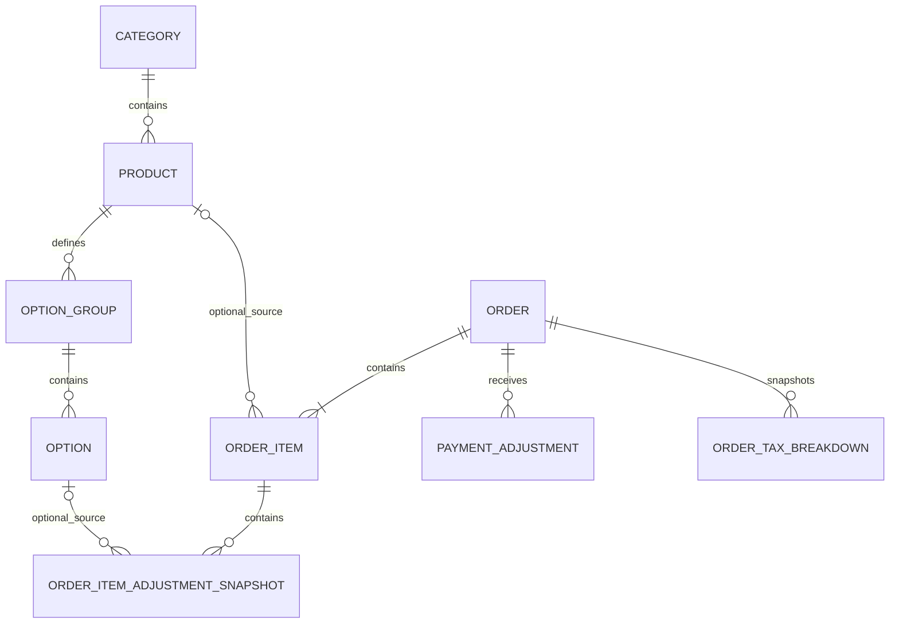

# Data model

**Status:** Approved — Phase 3 baseline  
**Last updated:** 2026-08-27  
**Product:** Sushi81 POS  
**Purpose:** Define the logical V1 business-data model required to implement the approved catalogue, order lifecycle, payment attribution, historical snapshots, source boundary and archive behavior.

## 1. Scope

This document defines the **logical V1 data model** for Sushi81 POS.

It covers:

- current catalogue identity and relationships;
- order identity and current lifecycle state;
- historical order-line and option snapshots;
- cumulative CB/Espèce amounts derived from internally dated payment adjustments;
- effective-versus-recorded payment dates;
- future / due-today / overdue derivation;
- the minimal hidden source discriminator required for Hiboutik paste-created orders;
- business configuration required by approved pricing rules;
- persisted VAT/tax snapshots;
- annual archive eligibility facts;
- relationships that must remain stable after current catalogue changes or deletion.

Physical database/storage choices are frozen in `architecture.md` and `storage-strategy.md`. Parser behavior belongs to `paste-order-import.md`; printing belongs to `printing.md`; export-batch/correction history belongs to `export.md`.

V1 does not require a separate `sync-and-backup.md`: live storage, recovery, OneDrive handoff, disaster recovery and annual archives are authoritative in `storage-strategy.md`.

## 2. Authoritative consequences

The logical model must preserve these approved semantics:

1. Current catalogue records and historical order data are independent after order confirmation.
2. Product codes are editable and reusable and therefore are not technical primary keys.
3. Current category names are operator-facing unique but are not technical primary keys.
4. All non-cancelled orders may be modified in place using the same stable order ID.
5. V1 retains only the latest saved business version of an order; no operator-visible revision-history subsystem is required.
6. Order status and payment information are separate.
7. The operator edits cumulative CB/Espèce amounts while the application internally persists signed dated adjustments.
8. Payment adjustments preserve both the business-effective payment date/time and the technical recorded timestamp.
9. The authoritative order total may be manually changed and may temporarily differ from line arithmetic.
10. Future, due-today and overdue are derived views, not independent destructive statuses.
11. A Hiboutik paste-created order uses the ordinary Order model and is distinguished only by a hidden source discriminator needed to prevent double counting/export.
12. Catalogue `.xlsx` update import uses opaque internal identifiers while keeping them transparent/non-editable to the normal operator.
13. No Customer/CRM master entity is required in V1.
14. Successful catalogue import does not require a permanent operator-facing import-history entity.
15. While a manual total override is authoritative, the complete authoritative TTC amount uses one 10% VAT bucket.
16. A non-zero enabled delivery fee uses fixed 10% VAT under normal calculated pricing.
17. Once an order has been saved as a future order, `advance_order_marker` remains true permanently for that order.
18. Export tracking is technical integration metadata and must not create a second order lifecycle.

## 3. Data-design principles

### 3.1 Opaque IDs are not business labels

Current catalogue entities use stable opaque identifiers such as:

- `category_id`;
- `product_id`;
- `option_group_id`;
- `option_id`.

These identifiers are generated and managed by the application. They are not normal business labels, are not normally editable by the operator and may appear in protected/hidden workbook columns only when required for safe update matching.

Business-visible uniqueness rules exist in addition to opaque IDs:

- current product code is unique among current products;
- current category name is business-visible unique, including normalization that prevents whitespace/case-only duplicates.

### 3.2 Historical orders are snapshots

A confirmed order remains interpretable after the current catalogue is renamed, repriced, deactivated, deleted or reused.

Historical viewing, printing and export therefore depend on persisted order/item/option/tax snapshots, not successful joins back to current catalogue data.

Optional source links may be retained for diagnostics or convenience, but they are non-authoritative.

### 3.3 Store durable facts once; derive views

The model stores authoritative facts and derives:

- Open / Closed / Cancelled;
- current payment composition and settlement state;
- future order;
- due-today advance order;
- overdue unsettled;
- daily received-payment totals;
- operational turnover;
- source-based reporting/export inclusion.

Derived conditions are not independently editable duplicate states.

### 3.4 Money and rounding

Persisted euro monetary values use the integer-cent physical representation frozen in `architecture.md`. Business calculations use decimal arithmetic and the deterministic round-half-up rules in `business-rules.md`.

Binary floating-point semantics must not determine persisted business-money results.

### 3.5 No speculative business/audit subsystems

V1 does not introduce:

- operator-visible order revision history;
- permanent catalogue-import history;
- Customer/CRM master solely for order reuse;
- a separate payment-method category;
- a dedicated Hiboutik emergency-order entity, discrepancy model or reconciliation workflow.

Technical logs, migration metadata and export-ledger metadata may exist when required for reliability without becoming operator-facing business workflows.

## 4. Logical entity overview

Core V1 logical business entities are:

- `Category`
- `Product`
- `OptionGroup`
- `Option`
- `Order`
- `OrderItem`
- `OrderItemAdjustmentSnapshot`
- `PaymentAdjustment`
- `BusinessSettings`
- `OrderTaxBreakdown`

Export adds separate technical integration/batch metadata as defined by `export.md`.

The optional source relationships are non-authoritative. Historical rows remain valid even when the former current-catalogue source is later changed or deleted.

## 5. Catalogue entities

### 5.1 `Category`

Logical fields:

| Field | Required | Meaning |
|---|---:|---|
| `category_id` | yes | Opaque technical identity |
| `name` | yes | Current editable business-unique category name |
| `created_at` | yes | Technical creation timestamp |
| `updated_at` | yes | Technical last-update timestamp |

Constraints:

- every current product references one current category;
- two current categories may not have operator-visible equivalent names;
- editing/importing a duplicate current category name is rejected;
- historical order lines keep their own category-name snapshot.

Category display order/shortcut presentation is a UI implementation choice and does not require a separate V1 business entity.

### 5.2 `Product`

Logical fields:

| Field | Required | Meaning |
|---|---:|---|
| `product_id` | yes | Opaque current product identity |
| `code` | yes | Editable operator-facing current product code |
| `name` | yes | Current product name |
| `category_id` | yes | Current category relationship |
| `price_ttc` | yes | Current TTC base selling price |
| `vat_rate` | yes | Current product VAT rate/category |
| `is_active` | yes | Offered in normal new-order selection when true |
| `discount_eligible` | yes | Eligibility for normal Retrait discount |
| `options_enabled` | yes | Whether structured option prompting is enabled |
| `created_at` | yes | Technical creation timestamp |
| `updated_at` | yes | Technical last-update timestamp |

Constraints:

- current `code` is unique;
- code is editable;
- permanent deletion releases the code for later reuse;
- historical use does not reserve a code permanently;
- product deletion/deactivation never cascades into historical order data.

### 5.3 `OptionGroup`

Logical fields:

| Field | Required | Meaning |
|---|---:|---|
| `option_group_id` | yes | Opaque technical identity |
| `product_id` | yes | Parent current product |
| `name` | yes | Operator-facing group/prompt label |
| `selection_mode` | yes | `SINGLE` or `MULTI` |
| `is_required` | yes | Required/optional semantics |
| `min_selections` | conditional | Multi-select minimum |
| `max_selections` | conditional | Multi-select maximum |
| `display_order` | yes | Product-specific prompt order |
| `created_at` | yes | Technical creation timestamp |
| `updated_at` | yes | Technical last-update timestamp |

Validation:

- required single-select => exactly one selection;
- optional single-select => zero or one;
- required multi-select => minimum at least one;
- optional multi-select may use minimum zero;
- multi-select minimum cannot exceed maximum.

A separate group active/inactive flag is not required in V1 because product-level option enablement and individual option activation already cover the approved workflow.

### 5.4 `Option`

Logical fields:

| Field | Required | Meaning |
|---|---:|---|
| `option_id` | yes | Opaque technical identity |
| `option_group_id` | yes | Parent option group |
| `name` | yes | Choice label |
| `price_adjustment_ttc` | yes | Preset positive/negative/zero adjustment |
| `is_active` | yes | Offered for new orders when true |
| `display_order` | yes | Persisted order inside group |
| `created_at` | yes | Technical creation timestamp |
| `updated_at` | yes | Technical last-update timestamp |

Option-adjustment VAT is automatic:

- positive adjustment => 5.5%;
- negative adjustment => associated product VAT;
- zero => no monetary tax effect.

Actual sale-time amount/VAT is snapshotted on the order line.

## 6. `Order`

`Order` is the durable latest business representation of one Sushi81 POS order, whether it was entered manually or created through the Hiboutik paste-import entry point.

Logical fields:

| Field | Required | Meaning |
|---|---:|---|
| `order_id` | yes | Stable unique business order identity allocated at confirmation |
| `source_type` | yes | Hidden discriminator: `POS` or `HIBOUTIK_PASTE` |
| `status` | yes | `OPEN`, `CLOSED` or `CANCELLED` |
| `created_at` | yes | Original durable creation timestamp |
| `updated_at` | yes | Latest saved modification timestamp |
| `closed_at` | no | Timestamp of current/latest successful Close |
| `cancelled_at` | no | Cancellation timestamp |
| `fulfilment_mode` | yes | `RETRAIT` or `LIVRAISON` |
| `planned_fulfilment_date` | yes | Business date used for reminders/turnover |
| `planned_fulfilment_time` | no | Structured planned time |
| `advance_order_marker` | yes | Sticky fact that the order has ever been saved for a future date |
| `telephone` | no | Order-level telephone text |
| `delivery_address` | no | Latest saved delivery address |
| `comment` | no | Flexible operational text |
| `total_ttc` | yes | Current authoritative order total |
| `manual_total_override_active` | yes | Whether current total is a manual override |
| `pickup_discount_applied` | yes | Whether normal Retrait discount is currently applied |
| `pickup_discount_rate_snapshot` | no | Applied discount rate snapshot when active |
| `delivery_fee_ttc_snapshot` | yes | Current applied order-level delivery fee |

`source_type` is non-user-facing. `HIBOUTIK_PASTE` does not create a special order subtype or different operator workflow.

### 6.1 Stable order identity and modification

`order_id` is allocated only when a new order is confirmed.

Ordinary modification:

- updates the same `Order`;
- retains the same `order_id`;
- replaces the latest saved business values;
- does not create a V1 revision chain.

Creating a new order from prior reusable customer information creates a new Order/new ID and does not create a Customer master relation.

Exact visible ID rendering is a technical/UI choice; uniqueness and stability are mandatory.

### 6.2 Status timestamps

Approved semantics:

- successful Close => `status = CLOSED`, set `closed_at`;
- later saved change causing CB + Espèce != total => `status = OPEN`, clear `closed_at`;
- later Close again => set a new current `closed_at`;
- cancellation => `status = CANCELLED`, set `cancelled_at`.

Only the latest business state is required.

### 6.3 Manual-total marker

`manual_total_override_active` identifies which tax rule is authoritative.

Semantics:

- normal pricing writes `total_ttc` and sets marker `false`;
- operator directly edits `total_ttc` => marker `true`;
- later price-affecting change recalculates total => marker `false`;
- another manual total edit => marker `true` again.

### 6.4 `advance_order_marker`

Semantics:

- starts `false`;
- if a non-cancelled order is saved while `planned_fulfilment_date` is later than the current business date, set `true`;
- once true, never reset for that order;
- later date/time/product/payment/customer changes do not reset it;
- cancellation need not clear it because Cancelled independently excludes active reminders.

It is not a lifecycle status; it remembers participation in the advance-order workflow.

## 7. Historical order-line snapshots

### 7.1 `OrderItem`

Logical fields:

| Field | Required | Meaning |
|---|---:|---|
| `order_item_id` | yes | Stable persisted line identity |
| `order_id` | yes | Parent order |
| `line_position` | yes | Saved display/print order |
| `source_product_id` | no | Optional non-authoritative current-product link |
| `product_code_snapshot` | yes | Sale-time product code |
| `product_name_snapshot` | yes | Sale-time product name |
| `category_name_snapshot` | yes | Sale-time category name |
| `base_unit_price_ttc_snapshot` | yes | Sale-time catalogue base TTC price |
| `product_vat_rate_snapshot` | yes | Sale-time product VAT |
| `discount_eligible_snapshot` | yes | Sale-time discount eligibility |
| `quantity` | yes | Ordered quantity |
| `base_line_total_ttc_snapshot` | yes | Base price × quantity result under approved rounding |
| `calculated_line_total_ttc_snapshot` | yes | System-calculated line result before any order-level manual total override |

The snapshot is refreshed when the operator intentionally modifies and saves that order, not merely because current catalogue data changes.

Historical viewing/reporting/printing/export use these snapshots.

### 7.2 `OrderItemAdjustmentSnapshot`

Selected predefined options and custom line adjustments are stored as sale-time snapshots.

Logical fields:

| Field | Required | Meaning |
|---|---:|---|
| `order_item_adjustment_id` | yes | Snapshot row identity |
| `order_item_id` | yes | Parent line |
| `display_order` | yes | Saved display/print order |
| `kind` | yes | `PREDEFINED_OPTION` or `CUSTOM_ADJUSTMENT` |
| `source_option_id` | no | Optional non-authoritative current-option link |
| `option_group_name_snapshot` | no | Group label when applicable |
| `label_snapshot` | yes | Choice/custom-adjustment label |
| `adjustment_ttc_snapshot` | yes | Positive/negative/zero amount |
| `vat_rate_snapshot` | conditional | Sale-time VAT for monetary adjustment |

This preserves the commercial state after option rename, deactivation or deletion.

## 8. Pricing snapshots

Historical orders retain the latest saved business result independently of later business-setting changes.

At minimum:

- `pickup_discount_applied` records current normal discount application;
- `pickup_discount_rate_snapshot` records the actual applied rate;
- `delivery_fee_ttc_snapshot` records the actual applied fee;
- enabled non-zero normal delivery fee uses fixed 10% VAT;
- `manual_total_override_active` identifies whether the single-10%-bucket rule is authoritative;
- `discount_eligible_snapshot` records sale-time line eligibility;
- option adjustments retain sale-time amount/VAT snapshots;
- calculated line totals remain persisted even when final `Order.total_ttc` is manually overridden.

Current configured minimum thresholds are validation parameters and do not need to be copied to every order.

A later price-affecting saved change recalculates the relevant pricing snapshots under then-current approved settings and resets manual-override state.

## 9. Payment model

### 9.1 Current composition

V1 stores no separate order-level payment-method category.

Current composition is derived from cumulative amounts:

- CB = 0, Espèce = 0 => unpaid/not recorded;
- CB > 0, Espèce = 0 => card only;
- CB = 0, Espèce > 0 => cash only;
- both > 0 => mixed.

Close validation remains:

`current CB + current Espèce = Order.total_ttc`

### 9.2 `PaymentAdjustment`

The application persists signed dated changes rather than merely overwriting one payment total.

Logical fields:

| Field | Required | Meaning |
|---|---:|---|
| `payment_adjustment_id` | yes | Technical event identity |
| `order_id` | yes | Parent order |
| `bucket` | yes | `CB` or `ESPECE` |
| `delta_amount` | yes | Signed change to the cumulative bucket amount |
| `effective_at` | yes | Business date/time to which received/corrected money is attributed |
| `recorded_at` | yes | Application-generated technical persistence timestamp |

Current cumulative values are derived as the sum of deltas by bucket.

The normal operator UI edits the current cumulative CB/Espèce values; it does not need to expose the internal ledger.

### 9.3 Effective date versus recorded timestamp — approved Phase 5 rule

The distinction is mandatory:

- `effective_at` controls daily received-payment attribution;
- `recorded_at` preserves when the adjustment was actually persisted.

Normal same-day entry defaults the effective date to the current business date so routine work requires no extra action.

For a genuine later-entered/back-dated payment or correction, the operator may choose the date on which the money was actually received. The resulting adjustment uses that selected date for `effective_at` while `recorded_at` remains the actual later persistence timestamp.

Example:

- €20 CB actually received 2026-08-26;
- entered in POS on 2026-08-27;
- operator selects effective date 2026-08-26;
- 2026-08-26 daily CB/received total receives the +€20 delta;
- `recorded_at` remains 2026-08-27.

Changing the effective date affects reporting attribution only. It does not create a second payment or alter an external bank-terminal transaction.

This rule is frozen in `docs/decisions/payment-effective-date.md`.

### 9.4 Cancellation retains payment facts

Cancellation does not delete `PaymentAdjustment` rows. Ordinary summaries exclude Cancelled orders through query rules rather than erasing retained facts.

## 10. Derived lifecycle/reporting views

### 10.1 Current payment state

Derived from current CB + Espèce relative to `Order.total_ttc`:

- zero => unpaid/not recorded;
- below total => partial/unsettled;
- equal => arithmetically reconciled/eligible for explicit Close;
- above => Close validation error.

Equality alone does not silently change saved status to Closed.

### 10.2 Future order

Derived when:

- planned fulfilment date > current business date;
- status != `CANCELLED`.

### 10.3 Due-today advance order

Derived when:

- planned fulfilment date = current business date;
- `advance_order_marker = true`;
- status != `CANCELLED`.

Payment and Open/Closed state do not remove the reminder.

### 10.4 Overdue unsettled

Derived when:

- planned fulfilment date < current business date;
- status != `CANCELLED`;
- order is not fully Closed/reconciled under the approved lifecycle.

### 10.5 Operational turnover

For date D:

- include only `source_type = POS`;
- exclude Cancelled orders;
- include orders whose planned fulfilment date is D;
- sum current authoritative `total_ttc`;
- ignore payment/closure state.

`HIBOUTIK_PASTE` is excluded automatically to prevent double counting.

### 10.6 Daily received-payment totals

For date D:

- use `PaymentAdjustment.effective_at` on D;
- group deltas by CB/Espèce bucket;
- include ordinary POS-originated, non-cancelled orders under the approved reporting boundary;
- sum deltas rather than whole cumulative order values;
- exclude `HIBOUTIK_PASTE` automatically.

The technical `recorded_at` timestamp does not move a legitimately back-dated effective payment into the later day's business summary.

## 11. Minimal Hiboutik source boundary

A Hiboutik paste-created order uses the same ordinary entities and editable fields as a manually created order.

The only source-specific persisted business distinction required in V1 is:

`Order.source_type = HIBOUTIK_PASTE`

Its sole business purpose is automatic anti-double-counting. A Hiboutik paste-created order is excluded from:

- ordinary POS-originated operational turnover;
- ordinary POS-originated received-payment totals;
- the ordinary POS CB amount that must newly be represented/entered in Hiboutik;
- export to `Gestion SUSHI 81`.

V1 explicitly does **not** model:

- `EmergencyImportDetail`;
- immutable original Hiboutik total;
- dedicated Hiboutik reference-number field;
- discrepancy status;
- Hiboutik-specific reconciliation/payment entity;
- raw pasted-email retention as business data.

If the operator wants to retain a Hiboutik reference, it is ordinary free text in `Order.comment`.

## 12. `BusinessSettings`

The current business-settings entity contains at least:

| Field | Required | Default |
|---|---:|---:|
| `pickup_discount_rate` | yes | 10% |
| `pickup_discount_min_total_ttc` | yes | €15.00 |
| `delivery_min_merchandise_total_ttc` | yes | €30.00 |
| `delivery_fee_enabled` | yes | false |
| `delivery_fee_amount_ttc` | yes | €0.00 |
| `updated_at` | yes | — |

No delivery-fee VAT-rate setting is required: the approved Sushi 81 delivery-fee rule fixes it at 10%.

V1 does not require settings-history as a business feature. Historical reproducibility comes from applied order/item/tax snapshots.

## 13. `OrderTaxBreakdown`

Historical/reprinted customer tickets require a durable tax snapshot.

Logical fields:

| Field | Required | Meaning |
|---|---:|---|
| `order_tax_breakdown_id` | yes | Technical identity |
| `order_id` | yes | Parent order |
| `vat_rate` | yes | VAT rate for this row |
| `taxable_ttc_amount` | yes | TTC amount allocated to the rate |
| `vat_amount` | yes | VAT amount under approved rounding |

Rows are replaced when a price-affecting saved change recalculates the order and when a manual total edit establishes a new authoritative tax snapshot.

### 13.1 Normal calculated total

When `manual_total_override_active = false`, tax rows derive from sale-time snapshots:

- products use saved product VAT;
- positive option adjustments use 5.5%;
- negative option adjustments use associated product VAT;
- non-zero enabled delivery fee uses 10%.

### 13.2 Manual total override

When `manual_total_override_active = true`:

- discard the current mixed tax allocation for the authoritative final snapshot;
- create exactly one tax row;
- `vat_rate = 10%`;
- `taxable_ttc_amount = Order.total_ttc`;
- calculate included VAT at 10% using approved round-half-up cent behavior.

A later normal price-affecting change resets the override and restores the ordinary mixed snapshot; another manual total edit recreates the single 10% bucket.

## 14. Telephone-history assistance without CRM

V1 does not need a Customer entity merely to support telephone-history assistance.

The application may query existing orders by normalized/searchable telephone value and display reusable prior address/comment information.

Creating a new order from an existing order copies reusable text values only and creates no durable customer master relationship.

## 15. Archive-related data requirements

The physical archive protocol belongs to `storage-strategy.md`, but the logical model preserves the facts required to determine archive year and historical behavior.

At minimum:

- original `created_at` remains retained;
- planned fulfilment date/time remain explicit;
- `status`, `closed_at` and `cancelled_at` remain explicit;
- Open orders can remain live across calendar-year boundaries;
- order/item/option/payment/tax snapshots make historical records independent of future catalogue/settings changes.

Archive-year derivation follows `storage-strategy.md`:

- Closed order => year of `closed_at`;
- Cancelled order => year of `cancelled_at`;
- Open order remains in `live.db` regardless of age.

The hidden source discriminator does not create a different archive schema or a dedicated Hiboutik archive entity.

Live and archive databases preserve compatible logical order data so archived orders remain queryable and reprintable without lossy transformation.

## 16. Data explicitly not modeled in V1 core

Unless a later approved specification amendment introduces a concrete need, V1 core does not include:

- employee/user accounts or roles;
- customer master/CRM profiles;
- inventory/stock;
- supplier/purchasing entities;
- accounting journals;
- card-terminal transaction IDs or refund execution;
- telephone-versus-walk-in source classification;
- ordinary order revision history;
- permanent catalogue-import history;
- automatic Hiboutik submission records;
- full Hiboutik synchronization;
- Hiboutik emergency-detail/original-total/discrepancy entities;
- dependence on current catalogue data for interpreting historical orders.

## 17. Approval

This document is the **Approved — Phase 3 baseline**, incorporating the later approved Phase 4 Hiboutik paste simplification and the Phase 5 payment-effective-date decision.

There are no remaining unresolved V1 logical-data-model questions.

Implementation may choose physical table/column names, indexes and other purely technical representation details only where they preserve every logical semantic above and the physical constraints already frozen in `architecture.md` and `storage-strategy.md`.